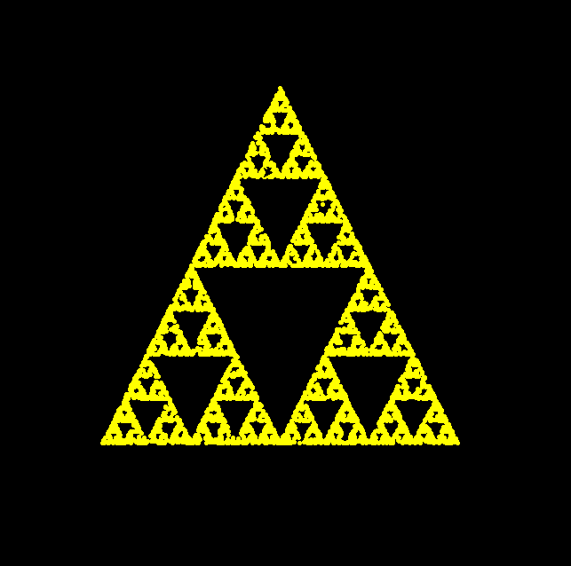
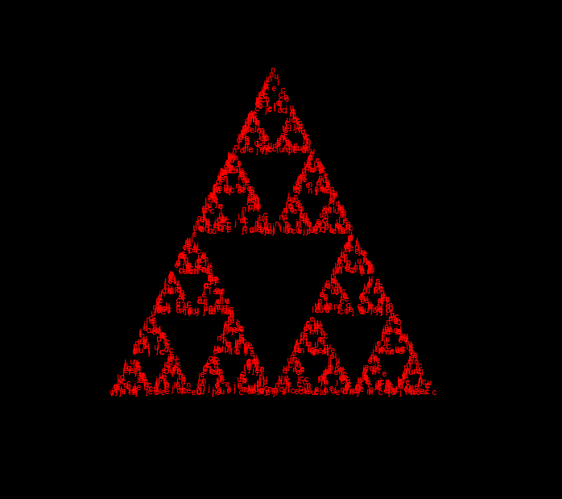
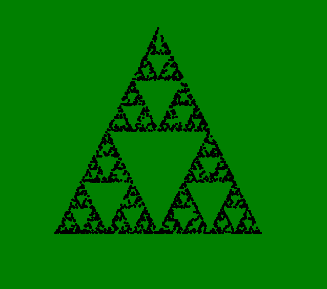

<a href="https://coff.ee/jncel">
  
</a>

# Sierpinski Triangle Chaos Game Visualization

This project visualizes the Sierpinski Triangle using the chaos game algorithm with Python's `turtle` graphics. You can customize the appearance and behavior or use default settings for quick plotting.

## Sample Drawings

Below are three sample drawings created using this code.  
You can find these images in the `sample_drawings` folder.

| Sample 1                                  | Sample 2                                  | Sample 3                                  |
| ----------------------------------------- | ----------------------------------------- | ----------------------------------------- |
|  |  |  |

## Features

- Draws an equilateral triangle and plots points using the chaos game.
- Customizable:
  - Background color
  - Plot color
  - Plot speed
  - Number of points (dot count)
  - Triangle height
  - Plotting text instead of dots (with optional random character selection)

## Requirements

- Python 3.x
- Standard library only (`turtle` and `random`)

## Usage

1. **Run the script:**

   ```sh
   python triangle.py
   ```

2. **Choose customization:**

   - Enter `Y` to customize plotting options, or `N` to use defaults.

3. **If customizing, provide:**

   - Background color (e.g., `black`, `white`, `blue`)
   - Plot color (e.g., `yellow`, `red`)
   - Plot speed (`0` is fastest)
   - Dot count (number of points to plot)
   - Triangle height (size of the triangle)
   - Optional: Text to plot instead of dots, and whether to randomize characters

4. **View the result:**
   - The turtle graphics window will display the Sierpinski Triangle.

## Example

```
Do you want to customize the plotting? (Y/N): Y
Enter background color (default 'black'): navy
Enter plot color (default 'yellow'): orange
Enter plot speed (0=fastest, default 0): 0
Enter dot count (default 10000): 5000
Enter triangle height (default 400): 300
Enter text if you want to plot text (leave blank for dot): *
Should we randomize the character on the text (Y/N)? N
```

## File Structure

- `triangle.py` — Main script containing all logic and user interaction.
- `sample_drawings/` — Folder containing example output images.
